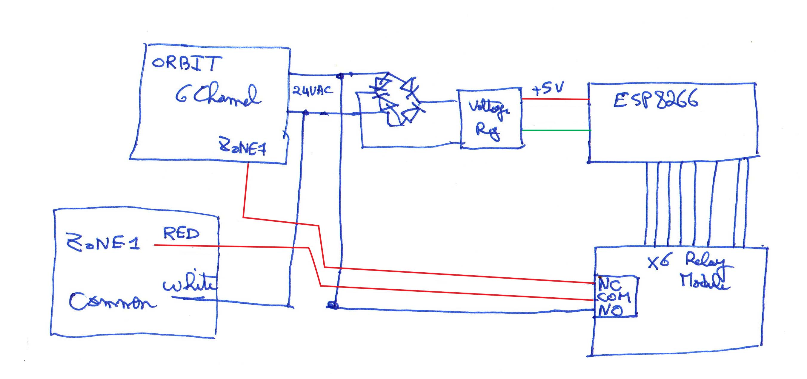
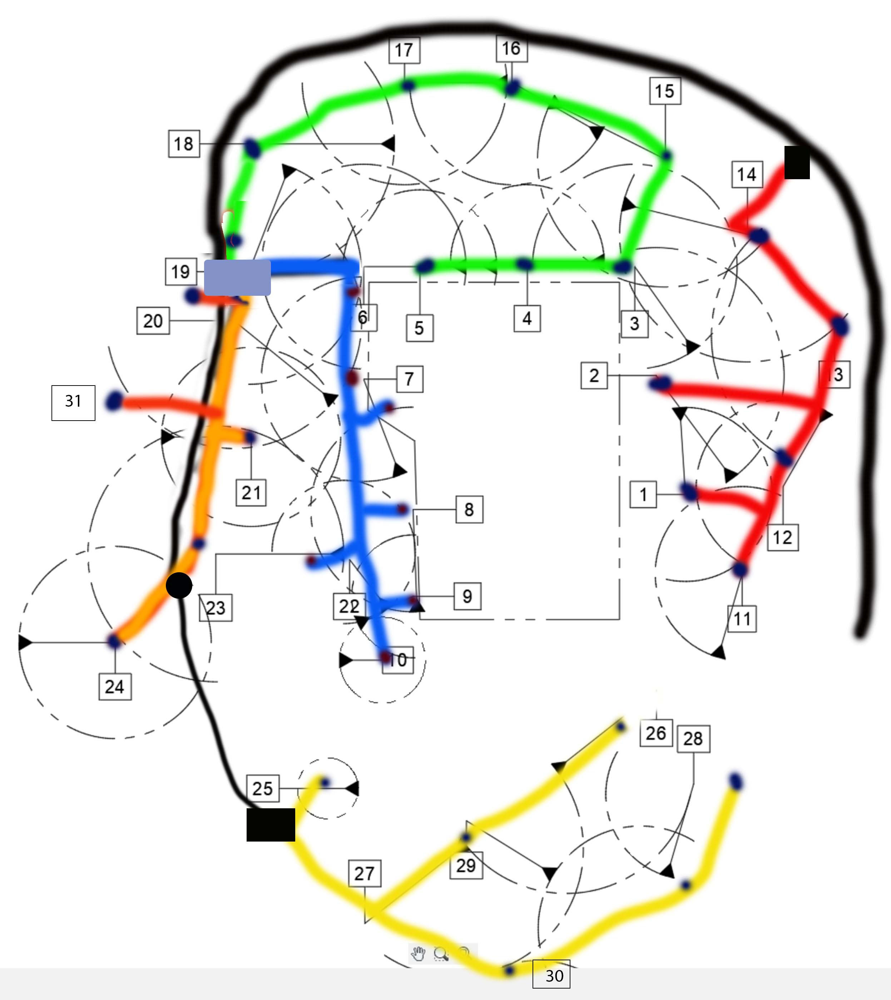

# RedIrrigation

[RED]Irrigation is an ESP8266-based IOT that drives RyeManor's Irrigation system

The hardware is designed to drive 6 zones even though only 5 are installed in Rye Manor. The implementation in OpenHab also only supports 5 zones, though it's easy to add a 6th.

## MQTT communication
Each zone has a status topic and a command topics. It can accept the following commands:
- ON -- turn zone on for 60 minutes
- OFF -- turn zone off
- a number -- turn zone on for that many minutes
- winterize -- turn zone on for 15 seconds, then off for 5 minutes to allow compressor to recharge
    this mode is on until it is turned off

After the command is executed, the _state topic_ is updated with the amount of time, in minutes, the zone will stay on.
state topic continues to be updated as the timer counts down. 
A state of **0** or **OFF** indicates that the zone is turned off.

# Version History

## 0.2 Beta
    Migration to Platform.IO including JSON6

## 0.9 RC
    Release candidate with full implementation of functionality including winterization
    to be installed in box under porch 4/19

# Hardware Notes

## Block Diagram

The irrigation system is installed so a dumb Orbit irrigation timer can be used in a pinch. Each zone is connected to the common pin of a SPDT relay. The Normally Connected terminal (NC) is wired into the Orbit Zone header. The Normally Open (NO) terminal is connected to power.

When the relay is not energized, the zone is connected to the Orbit timer and can be turned on and off.

If we command a zone on, relay energizes and connectes the zone to power.

## ESP8266 Pins

   
| Zone  | Pin  | Color  | Location        |
|:---:|:---:|:---:|:---|
| 1 | 5 | Red  |  Front of House |
| 2 | 4  | GREEN | South Side  |
| 3 | 14  | BLUE | Back Lawn  |
| 4 | 12 | ORANGE | Rear Lawn |
| 5 | 13 | YELLOW | Driveway |
| 6 | 15 | BROWN | **Not Connected ** |

// ***BEWARE*** Some ESP8266 pins (15) are set to LOW during boot or flash which activates the relay

## Zone Layout

